# Word Index Editor User Guide

**Draft of 30 August 2026.** Nothing is marked *[blocked]* any more.

*The two sections marked "not yet built" on 25 August, the Generated index page
and the index document, were built on 28 August and the markers are gone. §2,
Installing it, was the last one waiting on packaging: it is written now against
the route that exists — running from source — and says what the packaged
installer will look like when there is one. A guide that cannot be finished
until the installer exists, and an installer built from the finished guide, is
a circle somebody has to step out of.*

**The figures are the application itself**, rendered from it rather than drawn:
`documentation/render_screenshots.py` opens the sample book in
`documentation/sample_book.py` and photographs each window. The book is
invented, because every real manuscript this application has been measured
against is a publisher's file under contract. Re-run the script whenever the
interface moves; a guide illustrated with pictures of an older version is worse
than one with none.

---

## 1. Introduction

This application builds an **embedded index** in a Microsoft Word manuscript.

### The shape of the job

You are sent a Word manuscript, usually earely in the editing process. You read it, decide on index entries and mark those entries in the text. You hand back a file that differs from the one you received **by the added fields and nothing else**. 

That last point shapes every write operation this product performs. The manuscript is not yours to improve, and the application is built so that you cannot change it by accident: the text is read-only, and the only things written into it are index fields and the bookmarks they need.

### What is an index entry

A Word index entry is an `XE` **field**, hidden text sitting at a point in the document, carrying the heading under which it should appear. Word's `INDEX` field collects these `XE` tags at layout and produces the index with page numbers. Because the field is hidden, you cannot see it in Word without turning on formatting marks (¶) and then you see field codes, rather than a formatted index entry. 

The application shows you the manuscript with a **marker** at the location of each entry instead. You as the indexer do not need to be concerned with strucuring an `XE` field in order to produce the index entry you wish, the application handles that for you.

### What it does

- Opens a `.docx` and shows the manuscript as text to read, not as a page.
- Shows every index entry the document already has, and where each one sits.
- Creates, edits and deletes entries, with Word's per-level sort keys.
- Handles a book that arrives as several files, in an order you set.
- Checks the finished index for the mistakes that are easy to make and hard to see.

### What it does not do

- **It does not decide what to index.** No term suggestion, no concordance, no model. Indexing is judgement about what a reader will look for, and is the responsibility of the indexer.
- **It does not change the manuscript.** Not; wording,  spelling, spacing, styles, filenames, or any other aspect of the manuscript – with the sole exception of inserting `XE` fields.
- **It does not generate the index.** Word does that, at layout, in the publisher's hands, because page numbers do not exist until then.
- **There are no page numbers anywhere in it**, and there cannot be.

---

## 2. Installing it

There are two ways in, and only one of them exists today.

### Running from source

**This is the route that works now**, and it is the one to use until there is an installer. It needs Python 3.12 or later and the ability to install a few packages with `pip`.

**Two repositories, not one.** The application is built on `bookindexcore`, a shared package the LaTeX and ToA tools use as well, and it is not published to PyPI — so it is installed from its own clone rather than downloaded. Clone them side by side:

```
git clone https://github.com/DWHowes/bookindexcore.git
git clone https://github.com/DWHowes/MSWord_Index_Editor.git

cd MSWord_Index_Editor
python -m venv .venv

# Windows (PowerShell):
.venv\Scripts\Activate.ps1
# macOS/Linux:
source .venv/bin/activate

pip install -e ../bookindexcore
pip install -e ".[qt]"
```

The `qt` part matters: without it you get the headless half — the reader, the backend and the checks — and no window. That split is deliberate and is what lets the shared package stay free of Qt.

With the environment active, `python main.py` opens the application, the same way the installer's shortcut will. An example Windows batch file:

```
@echo off
cd /d <the folder you cloned into>
call .venv\Scripts\activate
python main.py
```

**Word itself is not needed to run this.** The application reads and writes `.docx` files directly and never asks Word to open one, which is the whole reason it can be used on a machine with no Word licence. You will want Word to *look* at the result, and the publisher certainly has it, but nothing here depends on it.

### Installing the packaged application

**There is no installer yet, and this section will name the release page when there is one.** That is not an oversight: the installer is built from a finished guide, and the guide is what tells you how to run the installer, so one of the two has to be written first. This one was.

When the installer exists it will follow the pattern the LaTeX Indexing Editor already uses, so what follows is what to expect rather than what to do:

* a Windows installer on the project's GitHub Releases page, run by double-clicking it;
* **no Python, no command line and no administrator rights** — it installs for your own user account only;
* a *"Windows protected your PC"* SmartScreen warning the first time. That is what Windows says about any installer that is not code-signed, and is not a sign that anything is wrong. Click **More info**, then **Run anyway**;
* a Start Menu entry, and a Desktop shortcut if you ask for one during setup.

**One warning worth expecting, because it has already happened on this machine.** Norton's `IDP.Generic` heuristic objects to newly built PyInstaller executables — it is judging the *shape* of the program rather than anything in it, so a new build with no reputation behind it is exactly what it flags. If it quarantines the installer, restore it from Norton's history and add an exclusion. An anti-virus product saying it has never seen a file before is not the same as one finding something in it.

Running from source stays supported afterwards, and is the only route on macOS and Linux: the packaged build is Windows-only.

### Where the application keeps its own files

Three things live outside your project folders, and knowing where they are matters when something looks wrong:

* **Style profiles** — what each publisher's styles mean, one entry per project. In your user application-data folder, as `style_profiles.json`.
* **Session logs** — a timestamped file per run, in a `session_logs` folder beside the profile store.
* **Preferences** — Qt's own settings store, per user.

**None of them is in the manuscript's folder**, and that is deliberate: that folder is the publisher's, and what goes back to them should differ from what arrived by the added index entries and nothing else.

---

## 3. Opening a manuscript

**File > Open document** opens one `.docx`.

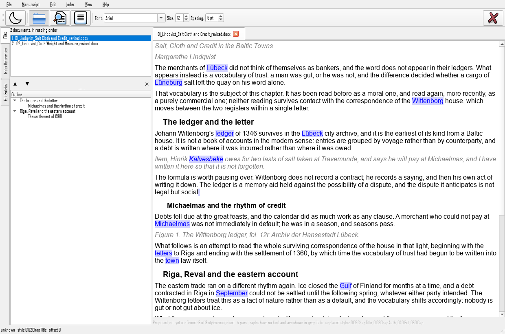

**Figure 3.1** The window with a manuscript open: the toolbar above, the sidebar's three tabs on the left, the manuscript in its own tab on the right.

What you see:

- **The manuscript**, on the right, one tab per open document. It shows the manuscript as structured text rather than as a page: headings look like headings, quotations are indented, captions are small. It deliberately does **not** reproduce the publisher's formatting, which is a typesetter's coding for a page nobody has laid out yet.
- **The sidebar**, on the left, with three tabs down its edge: **Files** (the documents of the project, and the manuscript's own outline beneath them), **Index References** (the terms), and **Edit Entries** (the entry table). One is shown at a time; the toolbar's three buttons and `Ctrl+B`, `Ctrl+Shift+I` and `Ctrl+E` bring each forward.
- **The outline**, under the file list, built from the headings. It is for finding your place and nothing else: headings are never insertion points.
- **The entry window**, which appears under the manuscript as soon as an entry is chosen, and folds away again with `Ctrl+\`.

This is the same frame as the LaTeX Indexing Editor's, deliberately, down to the keyboard shortcuts: an indexer who works in both should not have to learn where anything is twice.

### The toolbar

Left to right: **dark mode**, the three sidebar panes, and the **font**, **size** and **spacing** the manuscript is read in. All three are reading preferences and nothing to do with the manuscript: they change what you see and never what the file says. **Spacing** adds air between paragraphs, and it is added to whatever gap a paragraph already has, so a heading keeps standing out from the text under it. All three are remembered between sessions, and they are this application's own, so they are not the LaTeX editor's.

The **View** menu holds the same things with their shortcuts, plus `Ctrl+\` for the entry window and `Ctrl+Shift+D` for dark mode.

### Closing

**File > Close project**, or `Ctrl+W`, puts the window back to how it opened. If any entries are unsaved it says how many before it discards anything.

### Regions you cannot index

Front matter, the bibliography, the generated index if there is one: these are shown **greyed rather than hidden**. If a region had simply vanished you could not tell a decision from a defect. Trying to create an entry in one is refused, and the refusal says which kind of region it was.

### The notice under the text

It says how many of the manuscript's styles the application recognises, and names the ones it does not. If it begins **"Proposed, not yet confirmed"**, nobody has told the application what this publisher's styles mean yet, which is section 4.

---

## 4. Telling it what the styles mean

**Manuscript > Styles** opens the list of every style in the book, with a sample of the text each one holds.

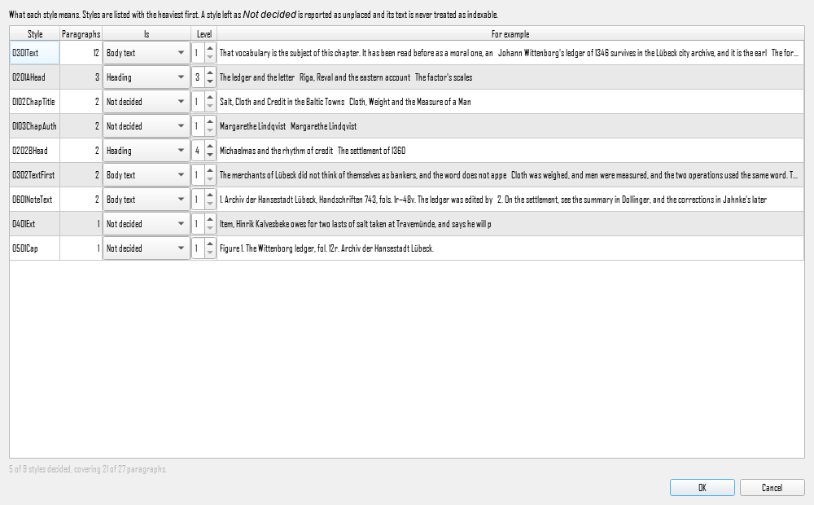

**Figure 4.1** The styles list, heaviest style first, each row showing a sample of its own text.

### Why this exists

A Word paragraph carries a style name, and the name is where the structure is. But **publishers do not agree** about what to call anything. Two schemes measured in one publisher's own books:

|                              |                            |
| ---------------------------- | -------------------------- |
| `0201A`, `0105Ext`, `0607TB` | Cambridge, numbered        |
| `01-Ahead0`, `02-Extract`    | Cambridge, hyphen-numbered |

and a third publisher sent files with **no house vocabulary at all**: 88% of the paragraphs carried no style, the rest used Word's built-ins, and chapter titles arrived as `Standard`.

No vocabulary is shipped with this application, because the next publisher will bring a fourth. Instead it **proposes** what it can and asks you to confirm. On the numbered Cambridge books the proposal places about 43% of the styles and on the hyphen-numbered ones about 93%, because the numbered vocabulary abbreviates and the matching looks for whole words. The proposal applies nothing and names what it missed.

### Working through the list

Styles are listed **heaviest first**, so the one holding two thousand paragraphs is decided before the one holding none. Beside each is a sample of its own text, which is usually the whole answer: `0607TB` means nothing until you see that it holds `CR 9`, `1351-52`, `8 m.` and is obviously a table.

For each style choose what it **is**. A heading also takes a level: 1 for a part or chapter, 2 for an A head, and so on.

A style left as **Not decided** is not a decision. Its paragraphs read as unknown, they are shown greyed, they cannot be indexed, and the notice under the manuscript names the style so you know it is waiting.

### Paragraphs with no style

These get their own row, labelled `(no style)`. Do not assume they are body text: in one publisher's books the unstyled paragraphs were the series-editor list and the blurb, and in another's they were 88% of the book. Look at the sample.

### Where it is kept

With the project, so you author it once. A book that arrives as eighteen files shares one profile, because it shares one template. It is **not** kept beside the `.docx`, because the manuscript's folder is the publisher's.

---

## 5. A first index, start to finish

This is the whole task once. Each step has its own section afterwards; this is the shape of the thing.

1. **File > Open document** on the manuscript.
2. **Manuscript > Styles**, and work down the list until the notice under the text stops naming styles it does not know.
3. Read. When you reach something to index, select the word or phrase and press **Alt+Shift+X**.
4. The entry window opens on the new entry. Refine the heading, add a sub-entry, set the sort key if the filing differs from the display.
5. Repeat. The index on the right fills in as you go.
6. **Index > Check index** when you are done, and work through the report.
7. **Index > Save entries**, and send the file back.

Nothing reaches the file until step 7.

---

## 6. The index: terms and entries

The index as it stands is in the sidebar, in two of its three tabs: **Index References** holds the terms, and **Edit Entries** holds the table of every entry. `Ctrl+Shift+I` and `Ctrl+E` bring each forward.

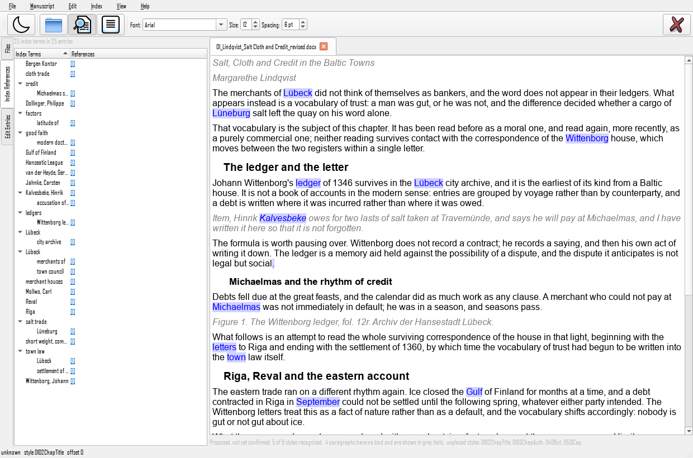

**Figure 6.1** The Index References tab: every term in the project, with each term's own references beside it.

### The terms

Every heading, with its sub-entries nested underneath, for the **whole project**, so a book in eighteen files shows as one index rather than eighteen.

Beside each term, under **References**, are its entries: `[1] [2] [3]`, one for each place in the book where that term is marked, in reading order. **Click one to go to it**, and the manuscript jumps there, opening another file first if the entry is in one.

The numbers count that term's own entries. They are **not page numbers** and there are none. A term showing `[1] [2] [3] [4] [5] [6] [7] [8]` is one you have marked eight times, which is worth a second look on its own: it is usually a heading that wants breaking up into sub-entries.

### The entries

The lower half is one row per entry across the project, with its heading, its sort key and its page style. The filter box above it narrows it as you type, matching the displayed headings and their sort keys, so filtering here searches the whole book at once.

The line above both says how many terms and how many entries the project holds. On a real 2,076-entry book that reads *1,127 index terms in 2,076 entries*, and the gap between the two numbers is the index doing its job.

---

## 7. Marking an entry

Select a word or a phrase in the manuscript and press **Alt+Shift+X**, which is Word's own shortcut for the same thing. **Index > Mark selection** does it from the menu.

With nothing selected it marks the **word under the caret**, which is the common case: put the caret in a term and mark it.

The entry is created immediately and the entry window opens on it, so you can refine the heading where you already are.

### What gets marked

The selected text becomes the heading, with its whitespace collapsed. A selection that runs past a paragraph break would otherwise carry a line break into the index.

The entry is anchored at the **start** of what you selected.

### When it refuses

- **A heading is not an insertion point.** Headings are for navigation.
- **An excluded region is not yours to index**: front matter, a bibliography, a generated index.
- **A style nobody has decided about** cannot be indexed, because the application does not know what it is.
- **Text the author has deleted with track changes**, and text inside a content control, are refused by name. A deleted passage is on its way out of the book; a content control is filled in by the publisher's own tooling, and an entry put inside one travels wherever that tool decides to put its contents.

Each refusal says which of these it was, in the status bar.

### Cross-references and other links

A word inside a hyperlink can be marked like any other, and the entry goes **inside** the link, which is where Word puts its own. This matters more than it sounds: a cross-reference to a figure or a chapter is exactly the kind of phrase an index wants, and manuscripts are full of them.

If your manuscript already carries entries inside links, they are listed, checked, edited and deleted here like the rest. They were not always: until 30 August 2026 this application read a link's text and not its entries, so a real Cambridge book showed 2,074 entries where Word saw 2,076.

### The markers

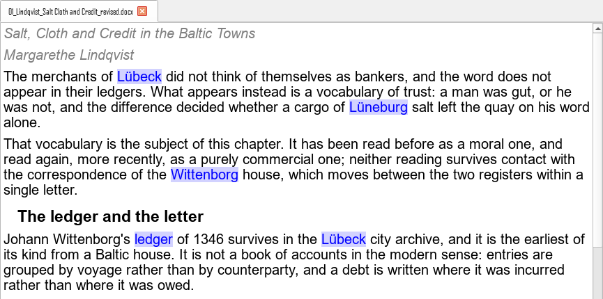

**Figure 7.1** Entry markers in the manuscript: the words in contrasting ink are where entries sit. Hovering one names the entries at it, which a still picture cannot show.

Every entry shows as a word drawn in **contrasting ink**. Several entries at one place are one marker; hover it to see which entries are there and how many.

**A page range shows how far it reaches**, not just where it starts. This matters more than it sounds: a range in Word is one field naming a bookmark, and the extent lives in the bookmark rather than in the field, so a tool that drew only the field would show you a range's opening word and nothing else. A range that overlaps another, or sits entirely inside one, would then be invisible until the generated index came out wrong. A bookmark with no end is left unmarked rather than given an invented extent.

The marked word is the one nearest the entry's anchor and is **not necessarily the term you indexed**. Word entries sit at a point between words, and the tool that wrote an imported book may have put its fields before or after the phrase.

---

### Taking it back

**Edit ▸ Undo**, or `Ctrl+Z`, reverses the last thing you did to the index:
a marked entry, a changed heading, a deleted entry, or an entire run of the
cross-reference consolidation. **Edit ▸ Redo**, or `Ctrl+Y`, does it again.
The menu items name the operation, so you read *Undo Consolidate
cross-references* and know what is about to come back.

An operation comes back whole. A consolidation that rewrote nine entries and
removed thirty-four is one item and not forty-three, because it was one thing
you asked for; if any part of reversing it were refused, none of it would
happen, and you would be told why. A document left half restored is worse than
one not restored at all, because nothing tells you which half.

`Ctrl+Z` here is the index's undo and not the manuscript's. The manuscript is
not yours to edit in this tool, so there is nothing else the key could mean.

**The history belongs to the project.** Opening another project empties it.
So does a manuscript changing on disk while you have it open, and that is
deliberate: the tool already refuses to write over a document somebody else
has edited since you opened it, so an undo list still offering to reverse an
operation into that document would be offering something that cannot happen.

Undo does not reach back past a save, and it is not meant to. Saving writes
the files; an undo after that changes the index again, and the next save
writes what you then have.

## 8. The entry window

Shows whichever entry is current, and creates new ones. It is a pane rather
than a separate window, so **closing it hides it** and `Ctrl+\` brings it
back; nothing you have typed is thrown away by closing it.

**With no manuscript open it is unavailable**, and says so if you reach for
the shortcut. That is worth stating because it used not to be: the window
would open over an empty tab and quietly discard whatever was typed into it.

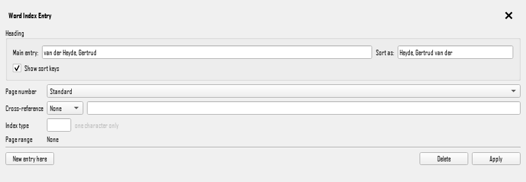

**Figure 8.1** The entry window, with a sort key on the main level: *van der Heyde, Gertrud* is displayed and *Heyde, Gertrud van der* is what it files under. The title bar is the window's own; closing it hides the pane.

### The heading

Up to three levels: a main entry and two sub-entries. **A gap ends the heading**, so a sub-entry 2 with an empty sub-entry 1 above it is treated as a slip rather than promoting it a level.

### Filed under

Beside every level. This is the field the window is really about.

Word takes a **sort key per level**, not one for the whole entry. Leave it blank to file under what is displayed, which is what you want most of the time. Fill it in when the two differ:

| Displayed               | Filed under            |
| ----------------------- | ---------------------- |
| `van Beethoven, Ludwig` | `Beethoven`            |
| `1984`                  | `Nineteen Eighty-Four` |
| `St Andrews`            | `Saint Andrews`        |

A blank key is not the same as a key equal to the displayed text; the placeholder reads *as displayed* to keep the two apart.

### Page number

Standard, bold, italic, or bold italic. This styles the **page number** in the generated index, not the heading.

### Cross-references

*See* and *See also*, with the target. Choosing **None** removes the cross-reference outright rather than downgrading it.

### Page ranges

A range in Word is **one entry naming a bookmark** that spans the passage, not a start and an end. So a range cannot be typed in. An entry that arrived with one keeps it through any edit you make here: on the real Cambridge book measured, 1,541 of 2,076 entries carry a range, and none of them lost it.

---

## 9. A book in several files

Most manuscripts are one file. An edited collection often is not.

### Building the project

Open the first document, then **File > Add document to project** for the rest. They go to the end of the list; put them in reading order with the arrows beside it.

**File > Name this project** gives it a name and stores it, so **File > Open project** brings the whole book back.

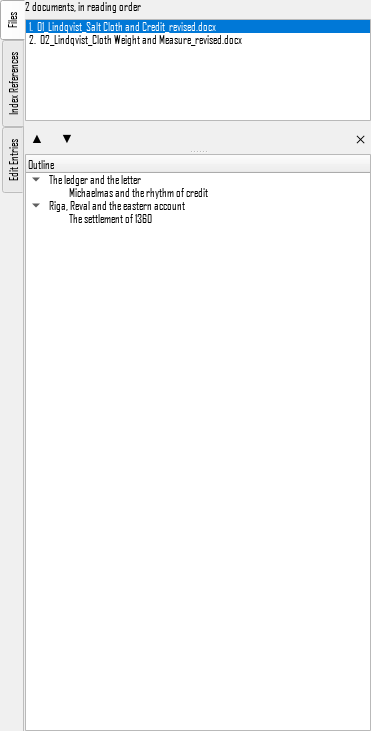

**Figure 9.1** The Files tab: the documents in reading order rather than filename order, with the open chapter's outline beneath them.

### The order is yours

Sorting by filename does not give reading order. One real 17-chapter book, sorted by the publisher's own names, ran:

```
   1. Margarethe Lindqvist...        (chapter 12)
   2. Ingrid Halvorsen...           (chapter 14)
   3. Ellery and Voss (chapter 1)
```

alphabetical by the author's first name. The order lives in the project, so **you never have to rename the publisher's files** to get it right. A renamed file is not a file that differs only by the added fields.

### What is shared and what is not

- **One index across the whole project.**
- **One style profile**, because the chapters share a template.
- **One manuscript on screen at a time.** Pick a document from the list.

### A document that will not open

It stays on the list, marked *not found*, and the rest of the project opens normally. A project that quietly shrank is one you cannot tell from one you built wrong.

---

## 10. Finding things

### In the manuscript

**Index > Find in manuscript**, or Ctrl+F. Searches the document on screen, forwards or backwards, with options for case and whole words. The manuscript is read-only, so this finds and does not replace.

### Across the project

**Index > Search the whole project**, or `Ctrl+Shift+F`, searches every document at once, exactly or fuzzily, and lists what it found.

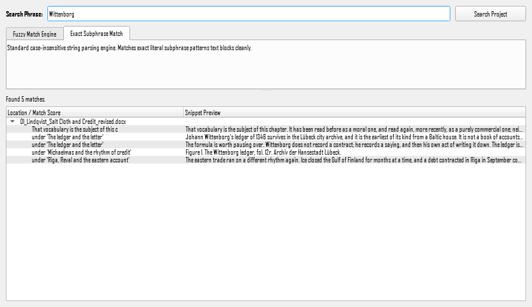

**Figure 10.1** The project search, with hits grouped by document and located by the heading each sits under.

A hit is reported **under the heading it sits beneath**, not by a line number. There are no lines in a Word manuscript and no pages until the book is composed, so a line number would be an invented figure, while *under '3.1.2. Context of the terms'* is where you actually are. Double-click a hit to go there; it is already a place an entry could be made.

### In the index

The filter box above the entry table, which is section 6.

---

## 11. Checking the index

**Index > Check index** runs the checking rules over every entry in the project and lists what they found.

It is a report, not a repair. Nothing is changed.

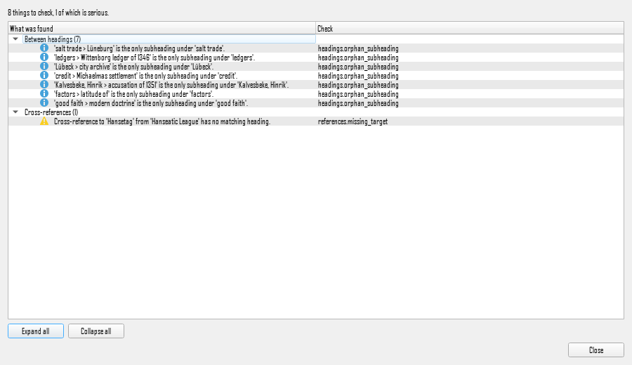

**Figure 11.1** The Check Index report, grouped by what each finding is about.

### Reading the report

Findings are grouped by what they are about, and each says which check produced it. Double-click one to go to the entry in the manuscript.

**A warning is not a mistake.** Most of these are patterns worth a second look: a heading with eight page references and no sub-headings is usually one that wants breaking up, but sometimes it is right. An **error** is different: it means the index will not do what it says.

### The one that is always an error

Two headings identical for their first 259 characters or so. Word compares only that far, so one of the two **silently disappears** from the generated index while both fields sit correct in the document. No warning, no error message, nothing to notice.

### Telling it your vocabulary

One rule objects to a capital letter inside a word, and it is right to: it is how `SpaceX` and `iPhone` are told from a typing slip. But it cannot know which of those your book uses, and on one real manuscript it produced 110 of 239 findings on its own. **Preferences > Check Index** is where you tell it the words your book uses on purpose. No vocabulary is shipped, because a Word book is as likely to be about medieval Flanders as about spaceflight.

### Choosing which checks run

**Preferences > Check Index** turns individual rules on and off. A rule turned off stays off for every project.

### Two checks about the document, not the index

Both live under *In the document* in **Preferences > Check Index**, and they report: neither ever changes anything. The first is **on**; the second is off until you ask for it.

**Damaged index fields — on.** A field whose beginning or end is missing. Word does not index it, and — measured by asking Word to render the page — **its instruction text prints in the book as ordinary text**. One real Cambridge manuscript in this indexer's own corpus prints, on page 25:

> …under which new design features could work**XE "Some Long Heading" \t "See Other"**. The book is divided into four parts.

This application cannot show it either: it reads a paragraph's text and a field's instruction is not text. So the fault is invisible in the manuscript view, invisible in the index, and visible in the proofs. That is what the check is for. Fix it in Word, where the field is; nothing here will repair a document.

**Index fields crossing a paragraph — off unless you ask.** A field that opens in one paragraph and closes in another. Word indexes it and this application reads fields a paragraph at a time, so such an entry would reach the printed index without ever appearing here.

It does something visible as well. The paragraph mark falls **inside** the field, so Word swallows it and **the two paragraphs print as one**, sentences run together:

> First paragraph, which ends here.Second paragraph, which begins here.

None of the 116 manuscripts measured contain one, and neither Word nor Index Manager writes them — which is why the check is off. Turn it on for a manuscript from tooling you do not know.

### What it cannot check

Anything that needs page numbers. Nothing here can tell you whether a range is too long or a locator too vague.

---

## 12. Preferences

**Index > Preferences**. These follow you from book to book; the style profile and the reading order belong to the project instead.

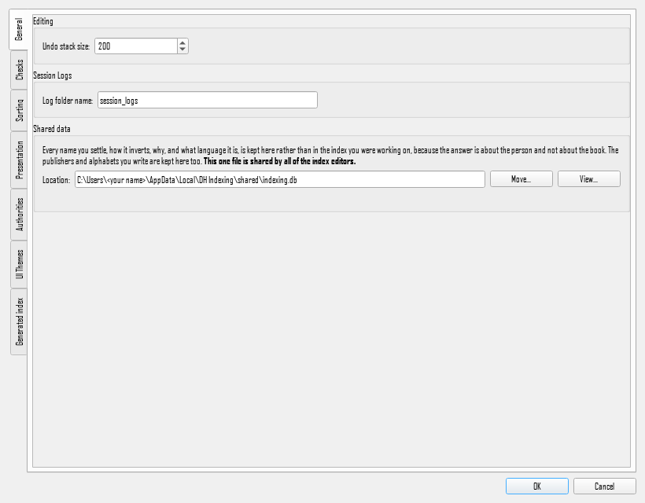

**Figure 12.1** The preferences window, with its pages down the left-hand edge.

- **General** covers recent projects and the shared name database.
- **Check Index** turns individual checking rules on and off, and holds the vocabulary of section 11.
- **Sorting** sets how headings are compared: letter-by-letter or word-by-word, and what to do with hyphens and other punctuation.
- **Presentation** covers how headings and cross-references are shown.
- **UI Themes** sets the colours, light or dark.
- **Generated index** is this application's own page, below.

### 12.1 The Generated index page

This page settles what Word's `INDEX` field will say when the publisher composes the book, and writes those settings into a separate document you can hand over with the manuscript. The field it will write is shown at the foot of the page, exactly as it will appear in that document.

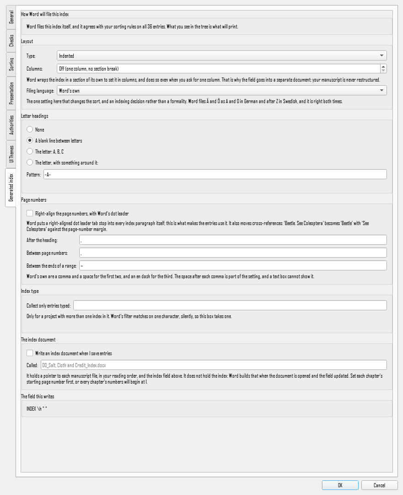

**Figure 12.2** The Generated index page, with the field it composes at the foot of it.

**Everything in this section was measured against Word 16**, on 25 and 28 August 2026, because Word accepts switches it then does not honour, and the documentation does not say which.

#### Layout

**Indented or run-in.** Run-in puts a term's sub-entries on the same line as the term, separated by semicolons, instead of on lines of their own.

**Columns.** Off, or a number. Word wraps the index in its own section to do this, which is why it goes into a separate document: it restructures whatever document it is written into, and it does so **even when you ask for one column**. The manuscript is never restructured.

**Filing language.** This is the one setting here that changes the **sort**, and it is an indexing decision rather than a formality. Word files Ä and Ö as A and O in German and **after Z** in Swedish, and it is right both times. If your book carries Scandinavian, Turkish or Eastern European names, this is the control that decides where they go.

#### Letter headings

A choice, not a free-text box, and the reason is worth knowing.

- **None.**
- **A blank line between letters.**
- **The letter**: `A`, `B`, `C`.
- **The letter, with something around it**: `-A-`, `[A]`, `A.`

Word's rule for the last of these is that **every `A` in the pattern becomes the group's letter, but only if the pattern's first letter is an `A`**. So `-A-` works and `Section A` does not: it silently produces blank lines, no warning, no error. Typing a pattern that Word would reject is refused here with the reason, and a preview shows what the first three groups would look like.

Word always draws the letter in **upper case**. Lower-case or small-capital letter headings are the `Index Heading` paragraph style's business, not this page's.

#### Page numbers

**Right-align them.** The page numbers go against the margin, with a dot leader running out to them.

**The leader is Word's, not this application's, and there is no control for it here.** Word writes a right-aligned dot-leader tab stop into every index paragraph it generates, whatever the styles say; turning right alignment on is what makes the entries use it. A leader this application wrote would land *beside* Word's rather than instead of it, so an index would draw dashes for its short headings and dots for its long ones. If you want a different leader, or none, change the tab stop in the composed index in Word, where you can see what you are changing.

**One thing to know before you turn right alignment on**: it also moves cross-references. `Beetle. See Coleoptera` becomes `Beetle` with *See Coleoptera* pushed against the page-number margin, which is not what any house style asks for.

#### Separators

Three of them, each with Word's own default:

| between                          | default    |
| -------------------------------- | ---------- |
| the heading and its page numbers | `, `       |
| one page number and the next     | `, `       |
| the two ends of a page range     | an en dash |

The range separator accepts as many characters as you like, including a word: `12 to 15` is as legal as `12–15`.

#### Index type

Only if your project uses more than one index. Word's index-type filter matches on **one character**, silently: `\f "toacases"` is accepted, written into the document, and then not filtered at all. The box therefore takes a single character and says so.

The page also tells you how many entries in the open project carry an index type, and which. That matters because of a default nobody chooses: **an `INDEX` field with no type excludes every entry that has one**, and Word reports that as an index with entries missing rather than as an error. This application holds your entries and writes the field, so it is the only thing in the room that can see both halves and say so.

#### What is deliberately absent

**Chapter-page numbering** (`\d` and `\s`). It needs sequence fields in the manuscript that a publisher's copy will not have, and on its own the separator setting does nothing whatever.

### 12.2 Writing the index document

A checkbox to enable it and a name for the file, which is written into the root of the project directory. **Index > Write index document** writes it whenever you ask; with the checkbox on, it is rewritten every time you save your entries.

The document contains a pointer to each manuscript file, in your reading order, followed by the `INDEX` field with the settings above. **It does not contain the index**: Word builds that when you open the document and update the field, which is the same division of labour as everywhere else here. Once built, the index is saved in that document and can go to the publisher with the manuscript.

This is a technique that already works by hand, and the application is automating it rather than inventing it. The pointers are Word `RD` fields with relative paths, so the index document travels with the book.

#### Page numbers across several files

**Set each chapter's starting page number before you build the index.** Word takes each referenced file's own numbering, so if every chapter starts at page 1 the index will say so, and it will look perfectly correct while being useless.

With the starting numbers set, the whole book indexes as one sequence. An 18-chapter collection built this way ran from page 1 to page 238, with entries from the first and last chapters interleaved in one alphabetical run.

#### Naming it

The default name puts the index document first in the folder, ahead of the chapter files, so it is where you will look for it.

#### Rewriting one you have already built

Once Word has built the index into that document, the document holds your finished index. Rewriting it from here **does not touch that**: only the pointers to your manuscript files and the index field itself are replaced, so a document whose index has been composed keeps it while its reading order is brought up to date. A file of that name which is not an index document is refused by name and left exactly as it was.

### Table of Authorities

Which citation standard the book is written in, and whose house style it
follows. Only used by **Index ▸ Build Table of Authorities…**; see §12a. The
standard decides which citation shapes exist, so it changes what is found —
a British book read as Bluebook finds almost nothing.

---

## 12a. A Table of Authorities

**Only if your book needs one.** Most books do not: a table of authorities is
a legal publisher's deliverable, listing every case, statute and secondary work
the book cites and where. **Index ▸ Build Table of Authorities…** is a command
you run when you want one, and it does nothing until you do.

### What it does

It reads **the whole project**, not one file, because a case cited in chapter 2
and again in chapter 9 is one authority with two places. It finds the
citations, works out which are the same authority under different short forms,
files them, and shows you the table it would build.

Then, for what you accept, it marks the manuscript: an `XE` field at each
citation, exactly as marking an entry by hand does, but carrying an index type
so the authorities stay **separate from your subject index**. Word builds the
tables from those fields when the index document is composed, which is where
the page numbers come from — the same arrangement as the subject index, and
for the same reason: this tool never invents a page.

### Before you run it

Tell it which standard the book is cited in, under **Index ▸ Preferences ▸
Table of Authorities**. There are three — Bluebook, McGill and OSCOLA — and the
choice decides which citation shapes exist, so it changes what is found. If
your publisher departs from the standard, choose their house style beside it;
if they are not listed, you can record one under *Publishers*.

**Getting this wrong is not subtle.** A British book read as Bluebook finds
almost nothing, because the shapes it is looking for are not there.

### The review

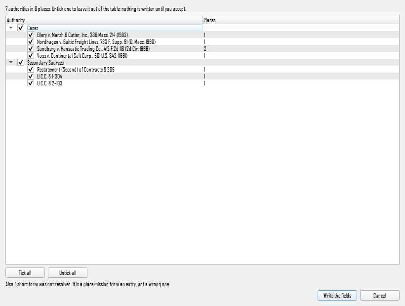

**Figure 12a.1** The review, on a two-chapter sample. Seven authorities in
eight places: *Sundberg* shows two because a short form later in the notes was
followed back to it. The line under the table is the one to read before
accepting.

You are shown the table as it would be: sections, and the authorities under
each with the number of places every one was found. Untick anything that does
not belong and it is left out entirely — no fields are written for it.

Nothing is written to your manuscript until you accept.

Under the table are the numbers that say how far to trust it. **Short forms
that were not resolved** are places missing from an entry rather than wrong
ones: a `supra note 14` the tool could not follow is a page that will not
appear. **Abbreviations no citation table recognises** are usually a typo in
the book and sometimes a gap in the tables; the entry is in the table either
way. And **rows struck** are near-duplicates the book's own back matter
produced — `Bibliography Poor Law Act 1930` beside the real *Poor Law Act
1930* — which are named rather than quietly dropped.

### Afterwards

The whole run is **one undo**. A real book writes over a thousand fields, and
taking them back one at a time is not something anybody would finish, so
`Ctrl+Z` reverses the lot.

The tables themselves are collected by `INDEX` fields in the index document,
so write it again from **Index ▸ Write index document** and you will have one
file holding the subject index and the tables of authorities side by side, each
a separate index. Build no table, or open another project, and the next write
takes those fields back out again.

**It is slow, and it says so.** Reading a million characters and writing a
thousand fields takes a few minutes on a real book, so both passes show
progress and both can be cancelled. A cancelled run keeps what it wrote, and
that is still one undo.

---

## 13. Saving, and what the publisher gets back

**Index > Save entries** writes your entries into the `.docx` files.

Nothing is written before that. Everything you do is held in memory until you save, so closing without saving loses the session's work and changes nothing on disk.

### What changes in the file

Index fields, and a bookmark for each one so the entry keeps its identity through later editing. **The visible text is what arrived.** That is checked, not assumed: a full session of creating, editing and deleting entries on a real book leaves the manuscript's text identical.

### What does not change

- Not the wording, the spelling or the spacing.
- Not the styles, the formatting or the layout.
- Not the filenames, even in a project where the reading order is nothing like the alphabetical one.

### If one file cannot be written

The others still are, and you are told which failed, by name.

### The index document, if you asked for one

If **Write an index document when I save entries** is ticked on the Generated index page (section 12.2), saving also writes or refreshes that document. It is a separate `.docx` in your project's folder, and **nothing about it touches your manuscript**: the manuscript files are written first and independently, and the index document is built afterwards from their names and your reading order.

You can also write it at any time with **Index > Write index document**, whether or not anything has been saved. If the document already exists and Word has built the index into it, that index is kept: only the pointers to your manuscript files and the index field are replaced.

### If a manuscript changes while you have it open

A file you are indexing can be edited elsewhere at the same time: in Word, by a colleague on a shared drive, or by a sync client putting a newer copy in place. This application notices, and **it will not save that document.**

The reason is the promise this section is about. Your entries are held against the text as it stood when the file was opened here, so writing them into a file somebody else has since changed would put them in the wrong places and overwrite that person's work into the bargain.

You are told which file it was, and how many changes you have made in it that are not yet written. **Nothing is lost at that moment**: your entries are still here, the file on disk is untouched, and every other document in the project saves normally.

**Index > Reopen changed documents** reads the file as it now is. That is the one decision the application cannot take for you, so it asks once per file and says what each answer costs: reopening discards the entries you made against the older version of *that document*, and every other document keeps everything.

### Before you send it

The file the publisher gets should differ from the one they sent by the added fields alone. Nothing here will have done otherwise, but it is worth knowing that is the promise being kept.

---

## 14. What Word does that surprises people

Measured, not assumed. Each of these is a place where Word accepts what you give it and then does something other than what you expected.

### The index type filters on one character

`\f "c"` works. `\f "toacases"` is accepted, written into the document, and then **not filtered at all**: the entry appears in every index. There is no error.

### An index with no type filter hides typed entries

The plain `INDEX` field excludes every entry that carries a type. That is correct and it is also the default, so an entry given a type disappears from the ordinary index without anything being said.

### Two long headings can collapse into one

Word compares roughly the first 259 characters of a heading. Two that agree that far are one heading to Word, and only one of them appears in the generated index. Both fields stay correct in the document, so nothing looks wrong anywhere. Check index reports this as an error.

### A page range is a bookmark, not a value

Other formats write a range as a start and an end. Word writes one entry naming a **bookmark** that spans the passage. So a range cannot be typed in, and an entry carrying one must not lose it when anything else about the entry is edited.

### A bold page number can be swallowed by a range

If a heading has a **page range** and also a **decorated page reference** (bold
or italic) falling on the range's **first page**, Word prints one span and
gives its opening number the decoration. The separate reference disappears, and
nothing reports it. In *the CUP monograph?* this is what produces

    orbital tourism, **45**-50

from a bold reference on page 45 and a range covering 45 to 50.

It happens only when the decorated entry comes **before** the ranged entry in
the manuscript. A decorated reference on the range's **last** page is not
swallowed: it is printed again after the range, as `40-45, `**`45`**. That
asymmetry is Word's, and it was measured rather than assumed; see
`documentation/page_style_measurements.md`.

Three ways round it:

* mark the decorated entry **after** the entry carrying the range, and Word
  prints both, at the cost of the page appearing twice;
* put the page style on the ranged entry itself, and the whole span is
  decorated (its dash stays plain, which is also Word's doing);
* do not decorate a reference that falls on a range's first page.

**Two references to one heading on one page print once**, whatever their page
styles, and Word keeps whichever comes first in the manuscript. A passing
mention marked plain and a discussion marked bold on the same page will show
only one of the two. There are fifteen such places in *the CUP monograph?*

Word never builds a range out of consecutive pages: `10, 11, 12` stays three
numbers, and a span only ever comes from a bookmark.

### The sort key is per level

`XE "van Beethoven, Ludwig;Beethoven:symphonies"` files the main entry under *Beethoven* and displays *van Beethoven, Ludwig*. One key for the whole entry is not the same thing: Word renders that as an extra index level with the sort key printed as visible text.

### Index entries in footnotes

Common advice says they do not work. Measured against Word: **an entry in a footnote does reach the generated index** with the right page. Some tools cannot write one reliably, which is probably where the advice comes from.

### Letter headings fail silently

Covered in 12.1, and it belongs on this list too: a heading pattern Word will not accept produces blank lines rather than a complaint.

---

## 15. When something looks wrong

### The manuscript is mostly grey italic

Grey italic means *no style profile has spoken for this paragraph*. The application will not guess what a style means. Open **Manuscript > Styles** and work down the list.

### The outline is empty

The book's headings are not styled as headings. Some publishers send chapter titles in a plain body style, with sub-headings typed into the text. Say so in the styles list and the outline fills in. If the manuscript genuinely has no styled headings, the outline stays empty and the manuscript is still fully usable.

### Marking is refused

The status bar says why: a heading, an excluded region, or a style nobody has decided about.

### You marked the wrong thing, or deleted the right thing

`Ctrl+Z`. Every change to the index is reversible, including a whole
cross-reference consolidation, and the menu item names what it is about to
reverse. See *Taking it back* in section 7.

### An entry is in the list but there is no marker

The entry belongs to another document in the project. Click it and the manuscript switches to that document.

### A marker is on the wrong word

The marker covers the word nearest the entry's anchor. Word entries sit between words, so an entry imported from another tool may have been placed before or after the phrase it is about. Hover the marker to see which entries are there.

### A term shows one reference and you marked it several times

It should not, and this was a real defect once. If you see it, the entries are still in the document: check the entry table below the terms, which lists them separately.

### The entry count changed after saving

It should not. If it does, something outside this application edited the file. Reopen it and compare.

### Check index reports hundreds of findings on one rule

Almost certainly the capital-letter-inside-a-word rule meeting a book full of names it has not been told about. Section 11 has the fix.
