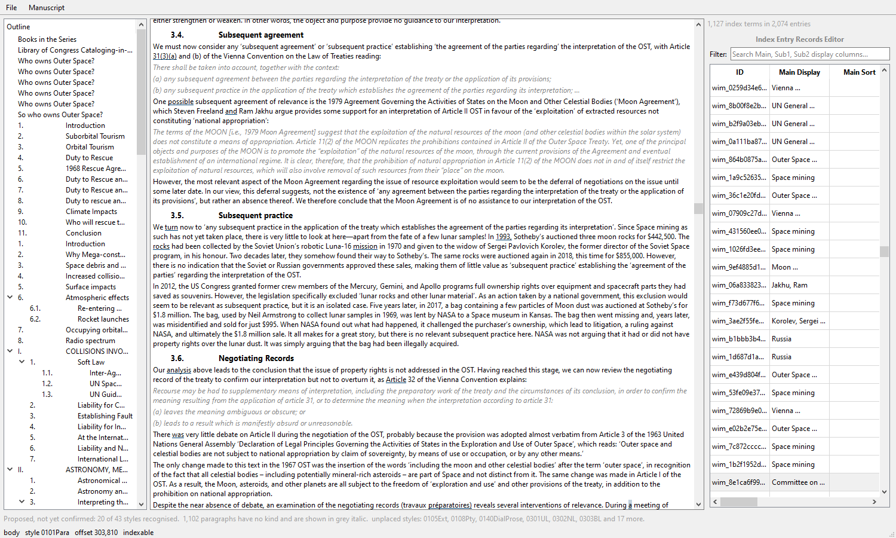

# Step 5: entry markers, and selection both ways

Scope §3 item 3: markers "unobtrusive and countable, showing where an `XE`
field sits without showing its field code. Clicking one selects that entry in
the index tree; the reverse also."

---

## 1. An entry did not know where it was

The step could not start until something was measured that had never been
asked for. `iter_entries` gives an **anchor and an ordinal**, and an ordinal
says *fourth field in this part*. That cannot be drawn on a page.

`OoxmlBackend.entry_positions(container)` is the answer: `anchor -> character
offset in the visible text`. It is the inverse of `place_at`, which puts a
field at an offset, and **the two share their arithmetic through one walk**,
because a marker drawn one character out is worse than no marker at all.

That sharing meant refactoring `_visible_nodes` into `_walk_para`, which now
yields every element with what it contributes to `read_text`. Three consumers
sit on it. *This is the same lesson as step 2's tab defect*, where three
copies of the same arithmetic drifted and every span after a tab came out one
character early.

Verified on the CUP monograph:

| | |
|---|---:|
| fields | 2,074 |
| positioned | **2,074** |
| out of document order | 0 |
| landing inside a known paragraph | **2,074** |

And they land where the indexer put them, which a count alone would not show:

```
  27,839  101955 Bennu (asteroid)   ...Introduction The[HERE] asteroid 101955 Bennu is just...
  29,075  Space mining:opposition   ...an off-Earth economy. But[HERE] some states oppose...
```

---

## 2. The marker design was a guess, and the data corrected it

The first version ran forward from the anchor to the next space, marking "the
word the entry is on". It seemed obvious. Run against a real book it produced
markers **one space wide**:

```
  27,839  ' '     <- 101955 Bennu (asteroid)
  29,070  '.'     <- OSIRIS-Rex probe (NASA)
  16,235  ','     <- Ruggie, John
```

**Word entries are points between words**, so the anchor lands on the space or
the comma beside the text it is about, not inside a word. Four of the first
five sat on whitespace or punctuation.

The rule that replaced it: an anchor on a visible character belongs to the
token holding it; an anchor on a space takes the token after it. Same books:

```
  27,839  'asteroid'    <- 101955 Bennu (asteroid)
  16,235  'Ruggie,'     <- Ruggie, John
  18,629  'phenomenon'  <- global governance:history of
```

**This is a heuristic and the documentation should not pretend otherwise.**
The tool that wrote these entries put some fields before the indexed phrase
and some after, so the marked word is the one nearest the anchor and is often
not the indexed term. *Which is why the tooltip exists*: the marker says an
entry is here, and the tooltip says which and how many.

---

## 3. Nothing is inserted into the document

A marker character would move every offset after it and break the contract
step 1 and step 2 are built on. So the layer is `ExtraSelection` formatting
over text that is character for character what the reader produced, and the
tests assert the document is unchanged rather than trusting it.

**Several entries on one word are one marker.** A measured book carries 2,074
fields at 1,538 distinct positions, and *Bennu* alone has two at the same
offset; one marker per field would stack invisible duplicates and count wrong.

### A defect the tests found

`show_paragraphs` cleared the marks but not the widget's selections, so
rebuilding the document through a new style profile left **stale selections
holding cursors into the document just discarded**. Found by the test that
re-reads a book after a profile change, which is now a real path since step 4.

---

## 4. `Signal(int)` delivered 0, and did not raise

`EntryModifierList.entry_row_selected` was declared `Signal(int)`. Word's ids
are `wim_<uuid>` strings, which `EntryId = Union[int, str]` explicitly
permits.

Emitting one does not raise. Shiboken prints a conversion warning to stderr
and **delivers `0`**:

```
Shiboken::Conversions::_pythonToCppCopy: Cannot copy-convert (str) to C++.
received: [0]
```

So clicking any row of a Word manuscript would have selected whichever entry
had id `0`. **Measured, not assumed**, and it is the third defect of this
exact shape found by being the core's second caller: after the `int()`
coercions and the `"None:None"` uid, a seam typed for one host's ids that
fails by giving a wrong answer rather than an error.

Widened to `Signal(object)`, which carries an int unchanged. The LaTeX
editor's 1,761 tests pass untouched.

---

## 5. Does it hold?

The scope asked for a measurement rather than a choice. Real platform, real
books:

| book | paragraphs | entries | positions | document | entry layer | select |
|---|---:|---:|---:|---:|---:|---:|
| the CUP monograph | 2,610 | 2,074 | 1,538 | 0.74 s | 0.59 s | 0.03 s |
| *Global Policymaking* | 2,946 | 1,058 | 834 | 0.41 s | 0.39 s | 0.01 s |

Every one of 400 sampled entries is findable by its own offset, which is what
a click does.



---

## 6. One trap worth keeping

`view.extraSelections()[0].format.toolTip()` raises *"Internal C++ object
already deleted"*. The list is a temporary and the format belongs to it, so
the binding can free it before the attribute is read. Binding the list to a
name first is the whole fix. It is a helper in the test file rather than a
comment, because every test would otherwise repeat it.

*This is the second PySide6 object-lifetime trap in this suite of
applications*, after the worker-lifetime one in ToA_Builder.

---

## Test coverage

`tests/ui/test_entry_markers.py` (20), on top of the 240 from step 4. **260
passing.**
