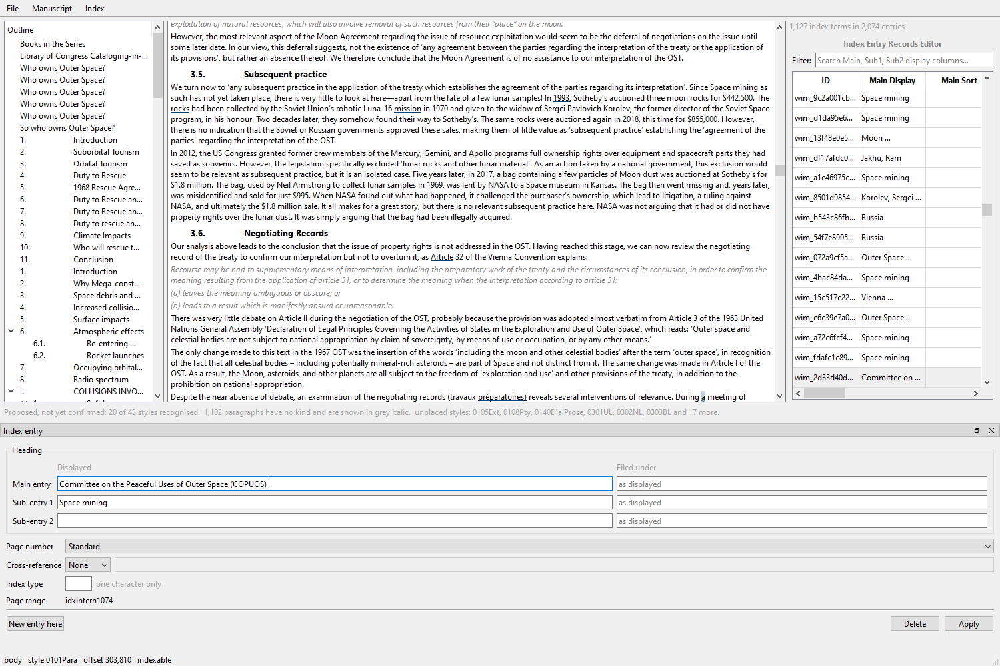

# Step 6: the index entry window

Scope §4. Create, edit and delete, with per-level sort keys.

---

## 1. The dialect could read an instruction and not change one

`entry_text_of`, `page_style_of_instruction`, `xref_payload` and
`range_bookmark` all read. Nothing composed. `with_index_class` was the only
writer, and it worked by *surgery*: replace one switch, copy the rest through.

That method's shape turned out to be the whole design. Four more were added on
the same principle:

    new_instruction(text)          with_page_style(raw, style)
    with_entry_text(raw, text)     with_xref(raw, kind, target)

**Surgical, never rebuilt**, and the reason is a number: **1,539 of the 2,074
entries in a measured book carry a `\r` bookmark this application does not
offer to edit**. A composer that assembled an instruction from the fields it
models would have dropped the range from every entry an indexer so much as
retyped. `\y` is in the same position.

*A writer that only writes what it understands is a writer that deletes what
it does not.* The tests include a `\z` switch invented for the purpose, which
no version of this code has ever heard of, surviving an edit.

---

## 2. The three things that make Word's window different

All three were measured in T3c and all three are visible in the window.

### A sort key per level

Word takes `display;sort` on **each** level, joined by colons. One key for the
whole entry renders as an extra index level with the sort key as printed text.
The LaTeX editor's form has one key for the entry, so this is not a
re-skinning of it.

So there is a *Filed under* box beside every *Displayed* box, and its
placeholder reads `as displayed`, because a blank key means "file under what
is shown" and that is not the same as a key that happens to equal the display
text.

Round-tripped through a real book: `Space mining;mining, space:opposition to`
reads back as `[('mining, space', 'Space mining'), ('', 'opposition to')]`.

### `\f` filters on a single character only

`\f "toacases"` is accepted by Word, written to the document, and **silently
not filtered**. A free-text box would be offering that defect with a straight
face, so the control has `setMaxLength(1)`, says *one character only* beside
itself, and explains why in its tooltip.

### `\r` needs a bookmark, not a value

Creating a range is an edit to the manuscript's bookmark table: the single
exception to §2 and one that has to be justified entry by entry. **The window
shows a range and does not create one.** Showing it is not optional at three
quarters of a real book; minting one is still open in scope §9.

---

## 3. The first real caller of `apply`

`OoxmlBackend.apply` carried this note:

> **[NEEDS RIGOROUS TESTING IN PHASE 8.]** Placement in particular. This
> application has no UI yet, so every path here has been exercised by the
> conformance battery and by nothing else, and the reason the interface
> changed at all is that the *previous* shape looked correct under the battery
> and turned out to be unusable by a real insertion path.

The entry window is that caller. Driven through it on the CUP monograph,
saved, and reopened from disk:

| | |
|---|---|
| entries before | 2,074 |
| after one edit, one creation, one deletion | 2,074 |
| **visible text identical** | **yes** |

The edited entry, read back from the saved file:

    XE "Space mining;mining, space:opposition to" \r "idxintern402" \b \i \t "See also Asteroids"

**The range came through an edit that never mentioned it.** Page style, both
switches, cross-reference and per-level sort keys all round-trip.

The created entry landed where it was asked to:

    ...to create legally relevant '[HERE]subsequent practice' in ...

The note is updated rather than deleted: **placement into a footnote container
is still untested**, and anything under a live Word instance belongs to the v2
COM backend.

---

## 4. A silent downgrade, caught by its own test

Choosing *None* for the cross-reference kind left the target text in the box,
and the target was passed through regardless. `build_xref("", "Dogs")` falls
back to the *See* prefix, so **selecting None turned `See also Dogs` into
`See Dogs`**: not a removal, a downgrade, and silent.

The window now decides that no kind means no cross-reference, whatever is
still sitting in the box.

*That is the fourth defect this session that fails by giving a wrong answer
rather than an error.* The others were the tree's `int()` coercions, its
`"None:None"` uid, and `entry_row_selected` delivering `0`.

---

## 5. What it refuses to do

**An empty main entry is not a delete.** Clearing the box and pressing Apply
says "A main entry is needed. Nothing was changed." rather than writing
`XE ""`.

**A gap ends the heading.** A filled sub-entry 2 under an empty sub-entry 1 is
a slip, and taking the lower one would silently promote it a level.

**A heading is not an insertion point**, which is answer 4 of 24 August, and
an excluded region is not the indexer's to work in, which is §5. Creating an
entry with the caret in either is refused by name: *"This is front matter, not
indexable text."* **That rule could not be tested honestly until step 4**,
because it reads `Paragraph.kind` and before a real profile most of a numbered
manuscript said "not decided".

**Nothing reaches disk until Save.** The backend holds lxml trees; Index >
Save entries writes them, and the status line says how many entries are not
yet saved.

---

## Test coverage

`tests/test_instruction_composer.py` (24) and `tests/ui/test_entry_window.py`
(28), on top of the 260 from step 5. **312 passing.**
