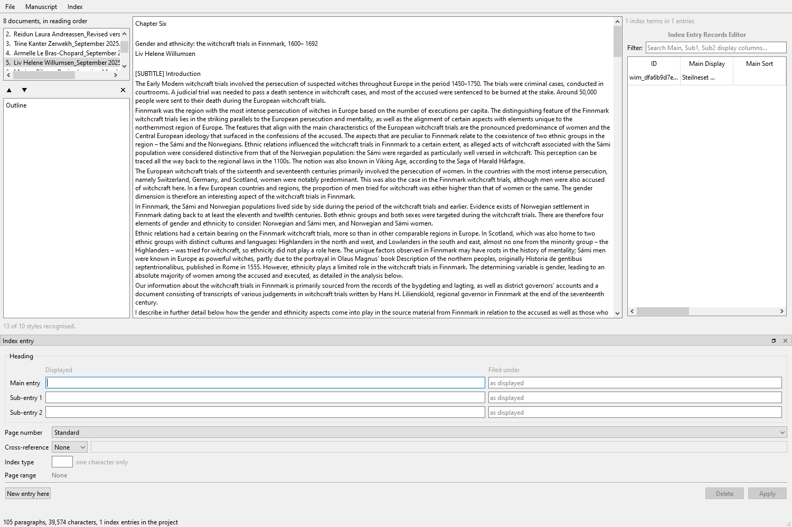

# Step 8: multi-file projects

Scope §5. Measured against a real 17-chapter book from Palgrave, *the Palgrave collection
Memorial and Feminicide*, opened from the publisher's own filenames.

---

## 1. What the order is for, and why the indexer had already worked around it

The eighteen files in that project folder are named `01_`, `02_`, `03_`…
**The indexer numbered them by hand.** The publisher's own names carry no
number at all, and sorted by name they run:

```
   1. Lindqvist_Revised version 2026.docx          (chapter 12)
   2. Halvorsen_September 2025.docx                   (chapter 14)
   3. Ellery and Voss_Revised version_...docx  (chapter 1)
   4. Nordhagen_Revised version 2026.docx    (chapter 17)
```

Alphabetical by the author's **first** name. Chapter 12 first, chapter 1
third. Their existing tool could only order by filename, so eighteen files
were renamed to get reading order into it.

**That renaming is what this step removes**, and it is not only convenience.
What goes back to the publisher should differ from what arrived by the added
fields and nothing else; a renamed file is not that. So the order lives in the
project and the filenames stay the publisher's. Verified after a full session
of marking, reordering and saving: `filenames still the publisher's: True`.

## 2. The backend did not have to change

`containers()` already returns every part of a document, so a project is a set
of files each with their own parts: a level above the backend rather than a
change to it. `OpenProject` holds one backend per document and the
bookkeeping.

## 3. Which document an entry is in

**Not the container.** Every document's body is `word/document.xml`, so across
17 files there is exactly one distinct container name and it identifies
nothing. Measured:

    distinct containers across the project: {'word/document.xml'}
    distinct documents behind them:         17

The **anchor** answers it, because it is `wim_` plus a UUID minted per field.
Checked on two CUP books opened as one project: entry ids do not collide.

That map is what routes an edit to the right backend, and the test for it
states the defect it prevents rather than the behaviour it wants.

## 4. An anchor is minted on open, and is not stable across opens

**Found by writing an assertion that compared ids from two opens of the same
file.** A field with no companion bookmark gets one minted into the in-memory
tree when the document is opened, and nothing reaches disk until save. So two
opens of one book give its un-bookmarked fields two different ids.

Nothing persisted keys on an entry id: the profile store and the project store
both key on paths. So this costs nothing today and would have cost a great
deal to discover later. It is now three tests rather than a comment.

## 5. Palgrave is a third kind of manuscript, and it breaks step 1's headline

Step 1 concluded that **structure in a `.docx` is declared, not inferred**,
measured across fifteen CUP books with two house vocabularies. That conclusion
is true of Cambridge and **not true of Palgrave**:

| | |
|---|---:|
| paragraphs across 17 chapters | 1,308 |
| distinct styles | 13 |
| paragraphs with **no style at all** | **1,154 (88%)** |
| styles `propose_profile` places | 6 of 13 |

The 13 are Word's built-ins and author leftovers, not a publisher's coding:

```
  1,154  (no style)          Louise Bourgeois's Installation in the High North
     70  Standard            Chapter Five
     30  BodyText            Burning Skies
     20  NormalWeb           Figure 1. the memorial's two buildings...
      7  Heading2            Chapter Eight
      3  Pa18                Figure 1. The art pavilion and the memorial hall
      2  xxelementtoproof    Keywords
```

`Pa18` is a PDF-converter artefact and `xxelementtoproof` is an Outlook one.
Chapter titles arrive as `Standard`; sub-headings are typed `[SUBTITLE]` in
the text itself.

**This vindicates the two decisions that looked most cautious.** Step 1
refused to call an unstyled paragraph body text, because on CUP those were the
series-editor list and the blurb; on Palgrave they are 88% of the book. A tool
that had guessed either way would be badly wrong on one of the two publishers.
And step 4's profile editor is what lets the same application be right about
both: on Palgrave the single decision *"(no style) is body text"* covers
1,154 paragraphs.

The proposal placing 6 of 13 here is the honest answer, not a failure, and the
notice says `Proposed, not yet confirmed`.

## 6. Driven through the window

| | |
|---|---|
| 17 documents opened | 1.5 s |
| marked in chapter 1, switched to chapter 12, marked again | markers redrawn per document |
| one index across the project | 2 entries in 2 documents, 2 rows in the table |
| clicked an entry from chapter 1 while in chapter 12 | switched documents and selected it |
| moved chapter 12 to the front | index order followed |
| saved and reloaded the project | 17 documents, order kept |
| saved the documents | 0 failures |



## 7. A defect the screenshot found

The notice read **"13 of 10 styles recognised"**, which cannot be true. It was
counting the profile's entries rather than how many of *this project's* styles
the profile places, and a profile authored for the whole book and applied to
eight chapters of it names styles those eight do not use.

*Found by looking at the window rather than by a test*, which is now the third
time in this application: the tab that ran an abbreviations list together at
step 2, the outline with no chapters at step 3, and this.

---

## Test coverage

`tests/test_project.py` (24), `tests/ui/test_file_list.py` (20), plus seven
more in `tests/test_profiles.py` for the project store and one in
`tests/ui/test_main_window.py` for the miscount. **373 passing.**
