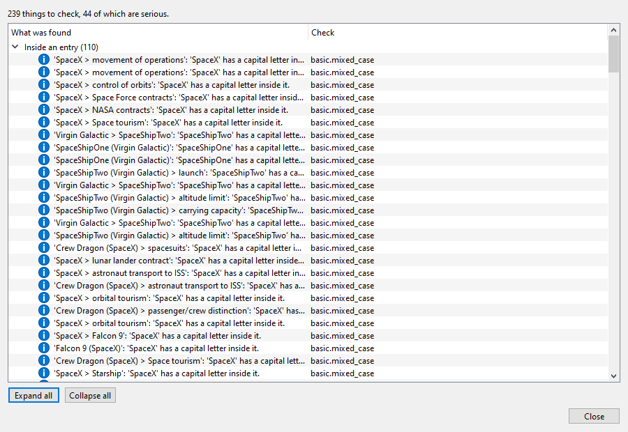
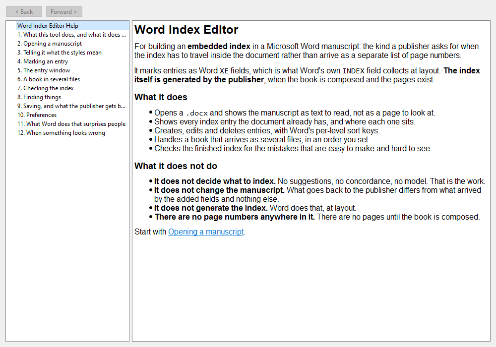

# Step 9: Check Index, find, preferences, help

Scope §7 calls this step "assembly of what already exists". **Three of the
four assembled; one did not**, and saying which is most of what this step
found.

---

## What assembled unchanged

**Preferences.** `PreferencesDialog(dialect)` gave five pages, General, Check
Index, Sorting, Presentation and UI Themes, for a subclass that supplies a
title and nothing else. This application adds **no pages of its own**, and
that is worth stating rather than leaving as an absence: the three things that
make Word's index grammar unusual are all decisions per entry, not settings.

**Find in the manuscript.** `TabFindDialog` emits
`find_requested(text, forward, case_sensitive, whole_word)` and knows nothing
about what is being searched. **The second shared widget to fit a second host
with no adapter**, after the entry table.

**The help viewer.** `HelpController` plus `content_model`, given an app root
and a directory of Markdown. Thirteen topics written; the wiring was a menu.

## What needed one thing the core cannot know

**Check Index.** `bookindexcore.checks` ships the rules and `FindingsDialog`
shows them. What it cannot know is **document order across files**: a backend
answers `order_key` for its own part, which is enough for one document and
wrong for a project, because two entries from two chapters both come back as
"third field in `word/document.xml`".

So the project's key is `(position of the document in the reading order,
position of the field in the document)`. The first half is step 8's order, the
one the filesystem does not know.

A `Locator` cannot say which document it is in, so this resolves it by anchor,
the same way an edit is routed to its backend.

Run on two CUP books opened as one project: **3,132 entries, 426 findings**
across four groups, every key in order.

## What did not assemble, and what was done about it

**`bookindexcore.ui.search`.** `AdvancedSearchWindow` took a
`db_file_paths_provider` returning paths to text files, grepped them, and
emitted `navigate_to_target(path, line, column, ...)`. All three are LaTeX's
shape: a Word manuscript is a zip of XML with no lines, and its text is
already in memory behind the reader. It also could not be imported without
`rapidfuzz`.

**This was first recorded and deferred to 6a. That was the wrong call**, and
the indexer said so: the point of building a second caller is to find *and
fix* a shared component's host assumptions, not to catalogue them. The stated
reason for deferring, that it would touch the LaTeX editor's contract, does
not survive scrutiny either, since `entry_row_selected` had been changed the
same session with that editor left green.

So it was made neutral. See `documentation/step9a_search_measurements.md`.

---

## The defect a real report exposed

Check Index over the CUP monograph: **239 findings, and 110 of them were
one rule saying that `SpaceX` and `SpaceShipTwo` have a capital letter inside
them.** Correct as written, every time, and between them enough noise to bury
the 44 serious findings underneath.

**The rule is right and needs no change.** Its own docstring says so:

> `LaTeX` is the example that proves the list is needed: nothing about its
> shape distinguishes it from a typing slip, so somebody has to say.

*Somebody has to say*, and nothing was saying. The shared preferences page has
had a **Mixed-case exceptions** field all along, and the shared runner has
always read `grammar.mixed_case_exceptions`; what was missing was anything
joining the two. This application was passing `ProjectGrammar()` with every
list empty.

`check_prefs.py` is that join. It **ships no vocabulary of its own**: the
LaTeX editor defaults to `LaTeX`, `BibTeX` and their neighbours because every
one of its projects meets them, while a Word manuscript is as likely to be
about medieval Flanders as about spaceflight.

*This is the fourth time this session that looking at the output found what a
test did not.*

### And one thing derived rather than stored

`enabled_rules()` is the rule set minus what is turned off, never a stored
list of what is on. A settings file written before a rule existed would
otherwise exclude it forever, silently.

---

## Two packaging hazards closed early

**The help root is inside the package.** `wordindex/` is installable: a root
one level up would be site-packages. `app_paths.py` is frozen-aware from its
first commit, because *the LaTeX editor located its help root by `__file__`
arithmetic that did not survive freezing and would have shipped an installer
with the whole Help system silently absent.* **Step 10 is packaging**, which
is exactly when this would otherwise bite.

**The version is stated once.** Read from the installed distribution rather
than written in `__init__.py`, so `pyproject.toml` is the only place it lives.
A version in two places is a version that disagrees with itself, and the one
the About box shows is the one a bug report quotes.

**And one dependency declared rather than discovered.** The help viewer needs
`markdown-it-py`. Declared in this application's `qt` extra rather than left
to the core's own `help` extra: an application that shows Help depends on it,
and an `ImportError` at the moment a user presses F1 is the worst possible
place to find that out.

---

---

## Test coverage

`tests/test_checking.py` (15) and `tests/ui/test_assembly.py` (14), on top of
the 373 from step 8. **403 passing.**

The help tests check the manifest **both ways**: every topic named in
`toc.json` exists, and every topic on disk is named in `toc.json`. A manifest
naming a missing file renders an empty page with no error, and a topic nobody
can reach is a topic wasted.
