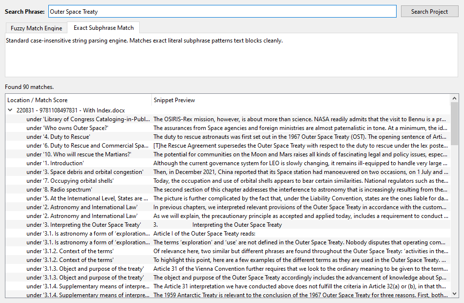

# Making the shared search host-neutral

Step 9 recorded that `bookindexcore.ui.search` did not fit this host and
deferred it to 6a. **That was the wrong call.** The point of building a second
caller is to find *and fix* a shared component's host assumptions, not to
catalogue them, and the reason given for deferring, that it would touch the
LaTeX editor's contract, does not survive scrutiny: `entry_row_selected` had
been changed the same session with that editor left green.

---

## What was host-specific, exactly

Six things, all one host's shape:

| where | what |
|---|---|
| `AdvancedSearchWindow.__init__` | took a `db_file_paths_provider` returning **file paths** |
| `SearchWorker.__init__` | took `scoped_file_paths: list` |
| `SearchWorker.process` | `os.path.exists`, `open()`, and a loop over **lines** |
| `match_found` | `Signal(str, str, str, str, int, int)`: file, location, snippet, **path, line, column** |
| `append_search_record` | grouped under an **absolute path**, packed `(path, line, col, snippet)` back into the item |
| `navigate_to_target` | `Signal(str, int, int, str, bool)` |

Plus two that were not about hosts at all but were found on the way: `rapidfuzz`
imported at module scope, so an application without it could not import the
module **even to search exactly**; and an unreadable file reported by
`print()` to stdout, where a packaged build has no console for it to reach.

## What is actually shared

Narrower than the module implied: **match a term inside a piece of text,
exactly or fuzzily, off the GUI thread, and stop when asked.** What was baked
in was *what the pieces are* and *where a hit lives*.

So `bookindexcore/ui/search/source.py` is new:

```python
SearchSegment(text, location, group="", where="")
SearchHit(group, where, snippet, location, offset=0, score=100)
```

and **the `location` on both is opaque**. The search stores it and hands it
back and never reads it, which is Phase 3's law for a `Locator` applied to the
one subsystem that had not kept it.

`FileLineSource` is in the shared package too, because one host's content
really is text files read line by line, and shared code should carry that
where it is true rather than pretend nobody does it.

### The field that turned out to matter most

`where` is **the host's own words**. One host answers `Line 42`, which is all
it can say and is genuinely useful there. This one answers

    under '3.1.2. Context of the terms'

because a Word manuscript has no lines and no pages until the publisher
composes it, so a line number would be an invented figure while the section is
where the indexer actually is. **That answer was not available at all under
the old contract**, which had a slot for a line number and nowhere else to put
anything.

---

## The two hosts, after

**LaTeX**: `source_provider=self._search_source`, returning
`FileLineSource(active_paths)` or None; and a five-line shim turning a hit
back into `(path, line, offset + 1, snippet, True)`. The `+ 1` is the one
piece of arithmetic that host does for itself, because counting columns from
one is its convention rather than a fact about searching.

**Word**: `search_source.py`, offering the project's paragraphs. A location is
`(document, character offset)`, **the same space `place_at` takes and the
marker layer draws in**, so a hit is already somewhere an entry could be
created with no second coordinate space to keep in step.

Excluded regions are searchable, deliberately: finding a phrase in the
bibliography is how an indexer learns it is there, and the marking gesture
already refuses to put an entry in one. Hiding it from search would be a
second, unasked-for decision.

---

## Measured

Two real books opened as one project, driven through the actual shared window:

| | |
|---|---:|
| segments offered | 5,432 |
| matches for *Outer Space Treaty* | 90 |
| whole search, through the window | **1.04 s** |
| matching alone, off the widget | 0.36 s |

Activating a result switches documents and lands on the right character;
checked directly for the first 25 hits of a book, that `location + offset` is
the position in `read_text` where the term really is.



### A figure worth correcting before it was reported

The first measurement said **30 seconds**. That was the probe calling
`QThread.wait()` from the main thread, which stops the queued `finished` from
ever being delivered, so the thread never quits and the wait runs to its
timeout. The pre-existing LaTeX test avoided it by polling an observable end
state instead, which is the right pattern and now the one used here.

*Nearly reported as a performance defect in the thing just built.*

---

## Where the tests went

**The LaTeX editor's tests of this window moved into `bookindexcore`.** They
were testing a shared widget from one host, which is how a shared widget
quietly acquires that host's assumptions, and this one had acquired six.

- `bookindexcore/tests/ui/test_search.py` (26): the neutral contract, driven
  by a fake host with **no files, no lines and no columns**, plus the window.
- `bookindexcore/tests/ui/test_search_worker.py` (12): the same behaviours as
  before, over `FileLineSource`, so the host whose content really is files is
  proved unbroken.
- `Latex_Indexing_Editor/tests/controllers/test_advanced_search_window.py`
  (8): that host's source provider and navigation shim, and one end-to-end run.
- `MSWord_Index_Editor/tests/test_search_source.py` (17): this host's
  segments, including two against real books.

All three applications pass: **bookindexcore, LaTeX 1,757, ToA Builder 336,
Word 422.**
